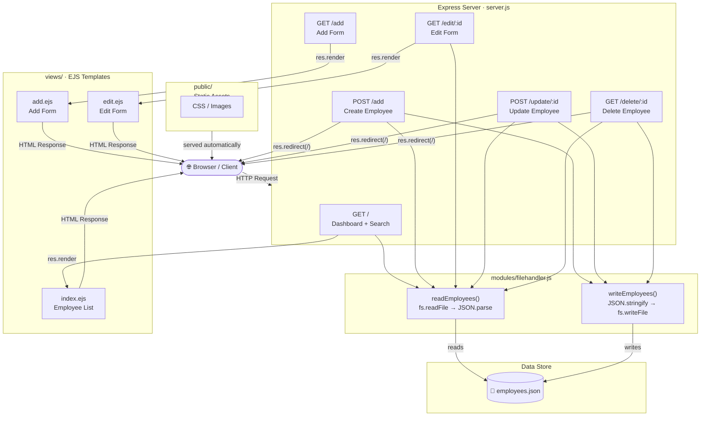

# 🏢 PayrollCore

A simple **Employee Payroll Management System** built with **Node.js**, **Express**, and **EJS** templating. Manage your workforce — add, edit, search, and delete employees — with data persisted to a local JSON file.

---

## 📦 Tech Stack

| Layer | Technology |
|-------|-----------|
| Runtime | Node.js |
| Web Framework | Express v5 |
| Templating | EJS |
| Data Store | `employees.json` (flat-file) |
| Static Assets | `public/` directory |

---

## 🚀 Getting Started

```bash
# Install dependencies
npm install

# Start the server
npm start
```

Server runs at **http://localhost:3000**

---

## 🗂 Project Structure

```
PayrollCore/
├── server.js            # Express app & route definitions
├── employees.json       # Persistent employee data store
├── modules/
│   └── filehandler.js   # readEmployees / writeEmployees helpers
├── views/
│   ├── index.ejs        # Dashboard (list + search)
│   ├── add.ejs          # Add employee form
│   └── edit.ejs         # Edit employee form
└── public/              # Static assets (CSS, images)
```

---

## 🔄 How It Works — Architecture Diagram



---

## 📋 API / Routes

| Method | Route | Description |
|--------|-------|-------------|
| `GET` | `/` | Dashboard — list all employees, supports `?search=` query |
| `GET` | `/add` | Render add-employee form |
| `POST` | `/add` | Submit new employee |
| `GET` | `/edit/:id` | Render edit form for employee `id` |
| `POST` | `/update/:id` | Submit updated employee data |
| `GET` | `/delete/:id` | Delete employee by `id` |

---

## 👤 Employee Data Model

```json
{
  "id": 1700000000000,
  "name": "Jane Doe",
  "avatar": "https://...",
  "gender": "Female",
  "department": "Engineering, Design",
  "salary": 75000,
  "startDate": "2024-01-15",
  "notes": "Senior developer"
}
```

---

## 📝 License

ISC
